# Медианный фильтр с переменным размером ядра

Лабораторная работа №1 по курсу «Системы компьютерной обработки изображений», вариант 4.
Выполнил: Яснов Михаил Андреевич, группа P3417.

Медианный фильтр реализован четырьмя способами: встроенной функцией `cv2.medianBlur`, двумя алгоритмами на чистом Python (наивным, с сортировкой окна, и алгоритмом Хуанга со скользящей гистограммой) и векторизованно на NumPy. Размер ядра задаётся параметром, это любое нечётное $k \ge 1$ (у `cv2.medianBlur` не больше 255). Все три собственные реализации совпадают с OpenCV бит в бит: это проверяют 133 теста и 96 сверок на трёх снимках и случайном массиве. OpenCV быстрее в 68–4720 раз в зависимости от метода и $k$: на сером кадре 256×256 при $k = 31$ он отрабатывает за 0,59 мс, алгоритм Хуанга за 139 мс, наивный алгоритм за 2,8 с. На шуме «соль-перец» плотностью 40 % медиана 5×5 даёт PSNR 25,4 дБ, а гауссов фильтр даже с лучшей σ только 17,4 дБ. Дополнительно сделан адаптивный медианный фильтр, у которого окно подбирается для каждого пикселя: на шуме до 70 % он на 2,5–3,8 дБ лучше медианы с лучшим фиксированным окном.

## Содержание

- [Как запустить](#как-запустить)
- [1. Теоретическая база](#1-теоретическая-база)
- [2. Описание разработанной системы](#2-описание-разработанной-системы)
- [3. Результаты работы и тестирования](#3-результаты-работы-и-тестирования)
- [4. Выводы](#4-выводы)
- [5. Использованные источники](#5-использованные-источники)

## Как запустить

Нужен Python 3.10 или новее.

```bash
python -m venv .venv && source .venv/bin/activate
pip install -r requirements.txt

python prepare_data.py          # сохранить тестовые снимки из scikit-image в data/ [16]
python -m pytest -q             # 200 тестов
```

Фильтрация одного снимка (результаты пишутся в `output/`, папка в `.gitignore`):

```bash
# алгоритм Хуанга, окно 7×7
python main.py data/camera.png -o output/out.png -k 7 -m huang

# все четыре метода подряд: время и сверка с OpenCV; перед фильтром добавить 10 % шума
python main.py data/astronaut.png -o output/out.png -k 5 -m all --noise 0.1

# окно с ползунками размера ядра и метода
python main.py data/coffee.png -k 5 -m huang --noise 0.1 --seed 42 --interactive

# адаптивный медианный фильтр, окно растёт до 11×11
python main.py data/camera.png -o output/out.png -k 11 --adaptive --noise 0.6
```

Замеры и эксперименты из раздела 3:

```bash
python benchmark.py             # скорость, ~1,2 мин на Apple M4; запускать на ненагруженной машине
python experiments.py           # корректность и качество, ~3 мин (наивный метод на k = 31 считается долго)
```

Оба скрипта пишут таблицы и графики в `results/`.

## 1. Теоретическая база

### 1.1. Определение

Пусть $f(x, y)$ обозначает яркость пикселя, а окно имеет размер $k \times k$, где $k = 2r + 1$. Медианный фильтр заменяет каждый пиксель медианой значений в окне вокруг него [1, 2]:

```math
g(x, y) = \operatorname{med}\,\{\, f(x+i,\; y+j) \;:\; -r \le i, j \le r \,\}.
```

В окне $N = k^2$ значений, и $N$ всегда нечётно. Значения окна образуют мультимножество: одинаковые яркости учитываются столько раз, сколько встречаются. Если упорядочить их как $v_{(0)} \le v_{(1)} \le \dots \le v_{(N-1)}$, медианой будет $v_{((N-1)/2)}$, для окна 3×3 это пятый по счёту элемент из девяти.

Медиана входит в семейство ранговых (порядковых) фильтров. Фильтр ранга $s$ возвращает $v_{(s)}$: при $s = 0$ получается минимум, то есть полутоновая эрозия, при $s = N-1$ максимум (дилатация), при $s = (N-1)/2$ медиана. Скользящую медиану для сглаживания рядов данных предложил Тьюки [3, 4].

Фильтр нелинейный. Возьмём окно из трёх отсчётов: $f = (0, 0, 9)$, $g = (9, 0, 0)$. У каждого медиана равна 0, а $\operatorname{med}(f + g) = \operatorname{med}(9, 0, 9) = 9 \ne 0 + 0$. Суперпозиция не выполняется, поэтому у медианного фильтра нет ни импульсной характеристики, ни частотной передаточной функции. Зато медиана перестановочна с любым монотонным преобразованием яркости $\varphi$ (гамма-коррекция, логарифм, порог): $\operatorname{med} \varphi(f) = \varphi(\operatorname{med} f)$, потому что такое преобразование сохраняет порядок отсчётов или разворачивает его целиком, а средний элемент нечётного набора при этом остаётся средним. Линейное преобразование тут частный случай: $\operatorname{med}(a f + b) = a \operatorname{med} f + b$ [5].

Цветное изображение обрабатывается поканально, так же поступает `cv2.medianBlur` [6]. У этого способа есть побочный эффект: медианы каналов B, G и R могут прийти от разных пикселей, и тогда на выходе окажется цвет, которого в окне не было.

### 1.2. Импульсный шум «соль-перец»

В модели шума каждый пиксель портится независимо от остальных с вероятностью $d$ (плотность шума). Половина испорченных пикселей становится чёрной, половина белой:

```math
\tilde f(x, y) = \begin{cases} 0 & \text{с вероятностью } d/2,\\ 255 & \text{с вероятностью } d/2,\\ f(x, y) & \text{с вероятностью } 1 - d. \end{cases}
```

Так работает `add_salt_pepper` из нашего пакета, у цветного изображения она портит все три канала пикселя разом.

Импульс принимает крайнее значение, поэтому после сортировки окна он оказывается в его начале (0) или в конце (255). Медиана стоит в середине и станет белой, только если белых пикселей в окне хотя бы $(N+1)/2$; с чёрными то же самое. Отсюда гарантия: пока импульсов в окне не больше $(k^2 - 1)/2$, на выходе получается неискажённое значение одного из соседей. Окно 3×3 выдерживает 4 импульса, 5×5 выдерживает 12, а 7×7 уже 24. Среднее устроено иначе: одна белая точка на фоне яркостью 100 сдвигает среднее окна 3×3 на $155/9 \approx 17$ уровней и портит девять пикселей вокруг себя.

При случайном шуме число белых пикселей в окне распределено по биномиальному закону $\mathrm{Bin}(N, d/2)$, и вероятность, что на выходе фильтра останется импульс, равна

```math
P_{\text{ост}}(k, d) = 2 \sum_{s=(N+1)/2}^{N} \binom{N}{s} \left(\frac{d}{2}\right)^{s} \left(1 - \frac{d}{2}\right)^{N-s}.
```

Мы посчитали её по этой формуле, предполагая, что чистые пиксели не равны ровно 0 или 255. Для снимка 512×512 вероятность $10^{-3}$ означает примерно 260 оставшихся точек.

| Плотность $d$ | 3×3 | 5×5 | 7×7 | 9×9 | 11×11 |
|---|---|---|---|---|---|
| 0,1 | 6,6·10⁻⁵ | 7,2·10⁻¹¹ | 1,2·10⁻¹⁹ | 2,6·10⁻³¹ | 8,1·10⁻⁴⁶ |
| 0,3 | 1,1·10⁻² | 3,4·10⁻⁵ | 7,7·10⁻⁹ | 1,3·10⁻¹³ | 1,5·10⁻¹⁹ |
| 0,5 | 9,8·10⁻² | 6,7·10⁻³ | 1,6·10⁻⁴ | 1,3·10⁻⁶ | 3,4·10⁻⁹ |
| 0,7 | 0,34 | 0,12 | 3,1·10⁻² | 5,6·10⁻³ | 7,1·10⁻⁴ |

### 1.3. Почему медиана сохраняет границы и что она теряет

Ступенька $(0, 0, 0, 9, 9, 9)$ после медианного фильтра с любым окном остаётся ступенькой: в каждом окне больше половины отсчётов лежит по ту же сторону скачка, что и центральный. Сигналы, которые фильтр не меняет, называют корневыми (root signals). Галлахер и Уайз показали, что для одномерной медианы это сигналы из постоянных участков и монотонных перепадов [7]. В двумерном случае так же ведёт себя прямая граница. Пусть пиксель лежит на тёмной стороне вертикального перепада, в $t$ столбцах от него: тогда в окне $r + 1 + t$ тёмных столбцов против $r - t$ светлых.

Усредняющий и гауссов фильтры считают взвешенную сумму, и у них скачок превращается в наклонный участок шириной порядка $k$ пикселей. В разделе 3.5 это видно на профиле ступеньки.

Недостатки медианы следуют из той же логики «большинства в окне»:

- тонкие линии пропадают. Прямая линия ширины $w$ занимает в окне $wk$ пикселей из $k^2$ и уцелеет, только если $wk \ge (k^2+1)/2$, то есть $w \ge (k+1)/2$. Окно 3×3 стирает линии толщиной 1 пиксель, 5×5 стирает до 2 пикселей, 7×7 до 3;
- углы скругляются. В угловом пикселе светлого квадрата окно 3×3 видит 4 светлых отсчёта из 9, и угол становится фоном;
- на гауссовом шуме медиана проигрывает среднему. При большом $N$ дисперсия выборочной медианы близка к $\pi\sigma^2 / (2N)$, у среднего она $\sigma^2 / N$: при том же окне шум остаётся в $\sqrt{\pi/2} \approx 1{,}25$ раза сильнее;
- стоимость растёт с размером окна (п. 1.6).

### 1.4. Роль размера ядра

У фильтра один параметр, $k$, и он задаёт компромисс. Из таблицы в п. 1.2 при $d = 0{,}5$ окно 3×3 оставляет импульсом почти каждый десятый пиксель, 5×5 оставляет 0,67 %, 7×7 уже 0,016 %. Платим деталями: исчезают линии тоньше $(k+1)/2$ пикселей, то есть 2, 3 и 4 пикселя для тех же трёх окон, а текстура мельче окна сглаживается.

Отсюда правило выбора: брать наименьшее $k$, при котором остаточных импульсов почти нет, потому что окно больше необходимого только размывает картинку. Порог «почти нет» мы взяли $10^{-3}$: на кадре 512×512 это около 260 точек, примерно 0,1 % пикселей. Тогда по таблице для $d = 0{,}1$ хватает 3×3, для $d = 0{,}3$ нужно 5×5, для $d = 0{,}5$ окно 7×7, для $d = 0{,}7$ уже 11×11. Оценка учитывает одни импульсы и не учитывает размытие, так что по PSNR оптимум может оказаться на шаг меньше. В разделе 3.3 правило сверяется с перебором.

«Переменный размер ядра» мы понимаем так же, как в соседнем варианте 3 («фильтр Гаусса с переменным размером ядра и параметрами гауссианы»): размер окна $k$ задаёт пользователь, а лучший $k$ для каждой плотности шума ищется в разделе 3.3.

Есть и другая трактовка, адаптивный медианный фильтр [1, разд. 5.3]. Он подбирает окно сам, для каждого пикселя своё. Окно растёт с 3×3, пока медиана окна совпадает с его минимумом или максимумом (то есть сама похожа на импульс), но не дальше заданного предела $S_{\max}$. Когда медиана нормальная, центральный пиксель остаётся как есть, если он не минимум и не максимум окна, иначе заменяется медианой. Такой фильтр мы тоже реализовали на чистом Python (п. 2.5) и сравнили с фиксированным окном (п. 3.6).

### 1.5. Обработка границ

У краевых пикселей часть окна выходит за кадр, и недостающие значения приходится чем-то заполнять. В OpenCV для этого три основных способа (обозначения из `BorderTypes`):

| Способ | Флаг OpenCV | Схема для строки `abcdefgh` |
|---|---|---|
| константа | `BORDER_CONSTANT` | `000\|abcdefgh\|000` |
| отражение без повтора края | `BORDER_REFLECT_101` | `dcb\|abcdefgh\|gfe` |
| повтор края | `BORDER_REPLICATE` | `aaa\|abcdefgh\|hhh` |

Для медианы константа плоха: в угловом пикселе от настоящего изображения в окне остаётся $(r+1)^2$ отсчётов из $k^2$, это меньше половины, и угол заливается нулём. На однотонном белом кадре при $k = 3$ темнеет по одному пикселю в каждом углу, при $k = 7$ по пять.

`cv2.medianBlur` не принимает тип границы и всегда повторяет край [6]. В собственном коде OpenCV сети сортировки ($k = 3, 5$) просто ограничивают номера строк и столбцов диапазоном кадра, а гистограммные ветки ($k \ge 7$) дополняют изображение слева и справа вызовом `copyMakeBorder(..., BORDER_REPLICATE)` [8]. На нашем стенде фильтр считает KleidiCV (п. 1.7), и OpenCV передаёт ему тот же тип границы, `REPLICATE`. Нативные версии дополняют каналы функцией `pad_replicate`, NumPy-версия вызывает `np.pad(mode="edge")`. Схема везде одна, поэтому результаты совпадают с OpenCV бит в бит.

### 1.6. Вычислительная сложность

| Алгоритм | Операций на пиксель | Идея |
|---|---|---|
| сортировка окна (наш `naive`) | $O(k^2 \log k)$ | собрать $k^2$ значений, отсортировать, взять середину |
| выбор медианы без полной сортировки (`np.partition`, наш `numpy`) | $O(k^2)$ | частичная сортировка introselect [9] |
| Хуанг, Янг, Тан, 1979 [10] (наш `huang`) | $O(k)$ | скользящая гистограмма окна |
| Перро и Эбер, 2007 [11] | $O(1)$ | гистограммы столбцов |

**Алгоритм Хуанга.** Окно 8-битного изображения описывается гистограммой $h$ из 256 счётчиков. При сдвиге окна вправо уходит левый столбец и приходит правый, это $2k$ изменений гистограммы вместо сортировки $k^2$ значений. Медиану заново не ищут. Хранят текущую медиану $m$ и счётчик $lt$, число пикселей окна со значением меньше $m$; при каждом изменении гистограммы $lt$ поправляется, если значение меньше $m$. После сдвига окна $m$ спускают вниз, пока $lt > (N-1)/2$, и поднимают вверх, пока $lt + h[m] \le (N-1)/2$. Соседние медианы обычно близки, поэтому подстройка занимает несколько шагов.

**Алгоритм Перро и Эбера.** У Хуанга всё упирается в столбец высотой $k$, который приходится добавлять поэлементно. Перро и Эбер хранят свою гистограмму для каждого столбца изображения. При переходе на следующую строку гистограмма столбца обновляется за две операции: убрать верхний пиксель, добавить нижний. Гистограмма окна при сдвиге вправо получается прибавлением гистограммы нового столбца и вычитанием ушедшего: 256 сложений при любом $k$. Константа велика, поэтому авторы делят гистограмму на два уровня (16 грубых корзин по 16 уровней и 256 точных) и обновляют точный уровень лениво, только для грубой корзины с медианой. Платить за это приходится памятью: по 256 счётчиков на каждый столбец.

Для малых окон оба метода проигрывают сети сортировки (sorting network): фиксированной последовательности операций «сравнить и переставить», без ветвлений. Сеть для 3×3 состоит из 19 таких операций и хорошо векторизуется. Наш `numpy` идёт третьим путём: `sliding_window_view` строит представление всех окон без копирования [12], после чего полоса строк разворачивается в массив $k^2$ значений на пиксель, а `np.partition` выбирает середину в C-коде. Асимптотика остаётся $O(k^2)$, документация NumPy прямо предупреждает об этом [12], зато в цикле по пикселям нет интерпретатора.

### 1.7. Как устроен `cv2.medianBlur`

Разбирали исходники тега 5.0.0 (в окружении стоит OpenCV 5.0.0). Функция `cv::medianBlur` в [`median_blur.dispatch.cpp`](https://github.com/opencv/opencv/blob/5.0.0/modules/imgproc/src/median_blur.dispatch.cpp#L186-L214) проходит четыре шага [8]:

1. Проверяет, что $k$ нечётное, а массив двумерный; при $k = 1$ просто копирует вход ([стр. 192–198](https://github.com/opencv/opencv/blob/5.0.0/modules/imgproc/src/median_blur.dispatch.cpp#L192-L198)).
2. Если результат запрошен как `UMat`, пробует ядро OpenCL; оно есть только для $k = 3$ и $5$ ([стр. 66](https://github.com/opencv/opencv/blob/5.0.0/modules/imgproc/src/median_blur.dispatch.cpp#L66), [200–201](https://github.com/opencv/opencv/blob/5.0.0/modules/imgproc/src/median_blur.dispatch.cpp#L200-L201)).
3. Вызывает внешний HAL, библиотеку ускорения под конкретный процессор ([стр. 207–208](https://github.com/opencv/opencv/blob/5.0.0/modules/imgproc/src/median_blur.dispatch.cpp#L207-L208)). Если HAL справился, работа закончена.
4. Иначе запускает собственный код из [`median_blur.simd.hpp`](https://github.com/opencv/opencv/blob/5.0.0/modules/imgproc/src/median_blur.simd.hpp#L860-L906).

Собственный код выбирает ветку по $k$, глубине и числу каналов:

| $k$ | Глубина и каналы | Функция и алгоритм | На пиксель |
|---|---|---|---|
| 3 | 8U, 16U, 16S, 32F; любое число каналов | `medianBlur_SortNet`, сеть из 19 сравнений, векторная ([стр. 641–723](https://github.com/opencv/opencv/blob/5.0.0/modules/imgproc/src/median_blur.simd.hpp#L641-L723)) | константа |
| 5 | то же | сеть из 113 сравнений ([стр. 724–855](https://github.com/opencv/opencv/blob/5.0.0/modules/imgproc/src/median_blur.simd.hpp#L724-L855)) | константа |
| от 7 до $T$ | только 8U с 1, 3 или 4 каналами | `medianBlur_8u_Om`: двухуровневая гистограмма (16 + 256) скользит по столбцу, змейкой: вниз, на следующем столбце вверх ([стр. 348–492](https://github.com/opencv/opencv/blob/5.0.0/modules/imgproc/src/median_blur.simd.hpp#L348-L492)) | $O(k)$, идея Хуанга |
| больше $T$ | только 8U с 1, 3 или 4 каналами | `medianBlur_8u_O1`: код самого Перро (так указано в шапке файла, [стр. 56–71](https://github.com/opencv/opencv/blob/5.0.0/modules/imgproc/src/median_blur.simd.hpp#L56-L71)), гистограммы столбцов, полосы по $512/cn$ столбцов ([стр. 84–346](https://github.com/opencv/opencv/blob/5.0.0/modules/imgproc/src/median_blur.simd.hpp#L84-L346)) | $O(1)$ |

Без SIMD окно 5×5 для 8U с 1, 3 или 4 каналами тоже уходит на гистограмму ([стр. 864–868](https://github.com/opencv/opencv/blob/5.0.0/modules/imgproc/src/median_blur.simd.hpp#L864-L868)). Другие глубины при $k \ge 7$ обрываются проверкой `src.depth() == CV_8U && (cn == 1 || cn == 3 || cn == 4)` ([стр. 897](https://github.com/opencv/opencv/blob/5.0.0/modules/imgproc/src/median_blur.simd.hpp#L897)). Порог $T$ зависит от размера кадра ([стр. 899–904](https://github.com/opencv/opencv/blob/5.0.0/modules/imgproc/src/median_blur.simd.hpp#L899-L904)):

```math
T = 3 + c \cdot s,\qquad c = \begin{cases} 12, & \text{кадр меньше } 2^{20} \text{ пикселей},\\ 6, & \text{меньше } 4 \cdot 2^{20},\\ 2, & \text{иначе}, \end{cases}\qquad s = \begin{cases} 1, & \text{есть SIMD},\\ 3, & \text{нет}. \end{cases}
```

У M4 есть NEON, а наши снимки меньше мегапикселя, так что $T = 15$: окна от 7 до 15 идут по Хуангу, начиная с 17 по Перро и Эберу.

Однако на нашем стенде до этого кода дело обычно не доходит. Колесо opencv-python 5.0.0 для macOS arm64 собрано с двумя внешними HAL: `cv2.getBuildInformation()` печатает `Custom HAL: YES (carotene (ver 0.0.1) KleidiCV (ver 26.03))`. Carotene медианный фильтр не реализует, а KleidiCV от Arm реализует [13], и на шаге 3 вызов уходит к нему ([`kleidicv_hal.cpp`, стр. 824–858](https://gitlab.arm.com/kleidi/kleidicv/-/blob/26.03/adapters/opencv/kleidicv_hal.cpp#L824-858)). Его ограничения ([`median_blur.h`, стр. 160–193](https://gitlab.arm.com/kleidi/kleidicv/-/blob/26.03/kleidicv/include/kleidicv/filters/median_blur.h#L160-193)):

- 8U: $k$ от 3 до 255. Окна до 7×7 считаются сетями сортировки, от 9 до 15 скользящей гистограммой, где на каждом шаге меняются $2k$ отсчётов, как у Хуанга; 16 соседних столбцов обрабатываются разом в векторном регистре NEON с 8-битными счётчиками ($15^2 = 225$ ещё помещается в байт). С 17 работают гистограммы столбцов по Перро и Эберу ([`kleidicv_thread.cpp`, стр. 615–654](https://gitlab.arm.com/kleidi/kleidicv/-/blob/26.03/kleidicv_thread/src/kleidicv_thread.cpp#L615-654));
- 16U, 16S, 32F: только $k = 3, 5, 7$;
- от 1 до 4 каналов, каждая сторона кадра не меньше $k - 1$, вход и выход в разных буферах;
- кадр режется на полосы строк, и они считаются параллельно через `cv::parallel_for_` ([`kleidicv_hal.cpp`, стр. 116–133](https://gitlab.arm.com/kleidi/kleidicv/-/blob/26.03/adapters/opencv/kleidicv_hal.cpp#L116-133)); в многопоточном режиме каждая полоса состоит из одной строки, и к чему это приводит, видно в п. 3.2. Собственный код OpenCV из `median_blur.simd.hpp` однопоточный.

Если KleidiCV отказывается, управление возвращается в собственный код OpenCV. Что вызов действительно уходит в KleidiCV, мы проверили на массиве uint16 с $k = 7$: `cv2.medianBlur` его обрабатывает, хотя документация [6] и собственный код OpenCV при $k > 5$ разрешают только 8U. Тот же вызов с `dst=src` KleidiCV отклоняет, и OpenCV падает на проверке из строки 897.

При $k > 255$ возврат в собственный код опасен: KleidiCV такие окна не берёт, а `medianBlur_8u_O1` считает гистограммы в 16-битных счётчиках, которых при $k^2 > 65535$ не хватает. На camera при $k = 401$ результат OpenCV не совпал с правильным в 43 % пикселей, а при ещё больших $k$ вызов падает на проверке. Поэтому наша обёртка `median_opencv` при $k > 255$ бросает `ValueError`.

Для раздела 3 отсюда следует главное: линия «OpenCV» на графиках показывает многопоточный NEON-код KleidiCV, а не код из `median_blur.simd.hpp`. Однопоточный Python честнее сравнивать с OpenCV при `cv2.setNumThreads(1)`, поэтому в замерах есть отдельная линия «OpenCV, 1 поток».

### 1.8. Метрики качества

Результат фильтрации сравниваем с чистым исходником по двум метрикам из `skimage.metrics` [14]. PSNR считается из среднеквадратичной ошибки по всем пикселям и каналам:

```math
\mathrm{PSNR} = 10 \log_{10} \frac{255^2}{\mathrm{MSE}}\ \text{дБ},\qquad \mathrm{MSE} = \frac{1}{HWC} \sum \bigl(f - g\bigr)^2.
```

SSIM [15] сравнивает в скользящем окне локальные средние, дисперсии и ковариацию:

```math
\mathrm{SSIM}(x, y) = \frac{(2\mu_x \mu_y + C_1)(2\sigma_{xy} + C_2)}{(\mu_x^2 + \mu_y^2 + C_1)(\sigma_x^2 + \sigma_y^2 + C_2)},\qquad C_1 = (0{,}01 L)^2,\ C_2 = (0{,}03 L)^2,
```

где $L = 255$; по умолчанию `structural_similarity` берёт окно 7×7 и усредняет SSIM по всем его положениям. Метрики реагируют на разное. Каждый оставшийся импульс даёт ошибку до 255 и сильно тянет PSNR вниз. Размытие ошибку отдельного пикселя почти не увеличивает, зато уменьшает локальную дисперсию $\sigma_y^2$ и ковариацию, а это видно по SSIM. Поэтому лучший $k$ по двум метрикам может не совпасть.

## 2. Описание разработанной системы

### 2.1. Архитектура

```
lab1/
├── median_filter/          пакет с фильтром
│   ├── __init__.py         реестр METHODS и функция median_filter(img, k, method)
│   ├── common.py           проверки входа, pad_replicate, поканальная обработка
│   ├── opencv_impl.py      median_opencv: обёртка над cv2.medianBlur
│   ├── native_naive.py     median_naive: чистый Python, сортировка окна
│   ├── native_huang.py     median_huang: чистый Python, алгоритм Хуанга
│   ├── numpy_impl.py       median_numpy: векторизация на NumPy
│   ├── native_adaptive.py  median_adaptive: адаптивный медианный фильтр, чистый Python
│   └── noise.py            add_salt_pepper: шум «соль-перец»
├── main.py                 консольная программа и интерактивный режим
├── benchmark.py            замеры скорости → results/bench_*
├── experiments.py          корректность и качество → results/*
├── plot_style.py           общий стиль графиков
├── prepare_data.py         выгрузка тестовых снимков из scikit-image
├── requirements.txt        зависимости
├── pyproject.toml          настройки pytest
├── tests/test_median.py    200 тестов pytest
├── data/                   camera.png, astronaut.png, coffee.png
└── results/                таблицы и графики для отчёта
```

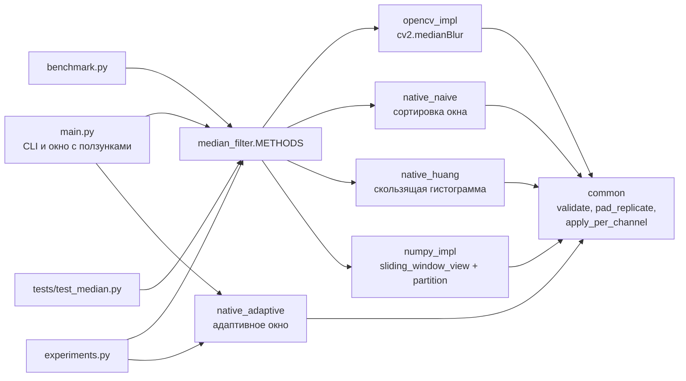

У четырёх реализаций из `METHODS` один контракт, поэтому их можно подменять друг другом в любом месте программы:

- на входе массив `uint8` формы (H, W) или (H, W, C) и целое нечётное $k \ge 1$;
- на выходе массив той же формы и того же типа, входной массив не меняется;
- граница обрабатывается повтором края, как `BORDER_REPLICATE` в OpenCV;
- на чётное, нулевое или отрицательное $k$ все методы бросают `ValueError`, на нецелое $k$, не-`ndarray` и тип не `uint8` бросают `TypeError`.

Собственные реализации принимают любое число каналов. У OpenCV есть свои ограничения (п. 1.7): KleidiCV берёт до 4 каналов при сторонах кадра не меньше $k - 1$, а собственный код OpenCV при $k \ge 7$ только 1, 3 или 4 канала. Например, массивы (64, 64, 5) при $k = 7$ и (20, 20, 2) при $k = 31$ дают `cv2.error`, а наши реализации их обрабатывают. Тип `uint8` мы ограничили сознательно: гистограмма Хуанга рассчитана на 256 уровней, да и сам `cv2.medianBlur` при $k > 5$ по документации берёт только 8-битные изображения [6].

Адаптивный фильтр `median_adaptive` в `METHODS` не входит: окно у него своё для каждого пикселя, и с `cv2.medianBlur` он не совпадает по определению. Его вход и проверки те же, а $k$ задаёт наибольший размер окна.

### 2.2. Что значит «нативно»

Нативные реализации работают на обычных списках Python, без NumPy и OpenCV внутри алгоритма. Функция `apply_per_channel` из [`common.py`](median_filter/common.py) переводит каждый канал в список строк через `img.tolist()`, вызывает фильтр одного канала и собирает результат обратно через `np.array(..., dtype=np.uint8)`. Перевод нужен только на входе и выходе, но в замеры времени он попадает: около 1 мс на кадр 256×256, то есть 3–5 % времени при $k = 3$ и около 1 % при $k \ge 15$. Цветное изображение фильтруется поканально, как в OpenCV.

Граница добавляется функцией `pad_replicate`: каждая строка получает по $r$ копий крайних пикселей слева и справа, а сверху и снизу добавляются $r$ копий первой и последней строки.

### 2.3. Наивный алгоритм

[`native_naive.py`](median_filter/native_naive.py): для каждого пикселя собрать окно, отсортировать встроенной сортировкой Python (Timsort) и взять элемент с индексом $k^2 // 2$.

```
padded ← pad_replicate(channel, r)
для каждой строки y:
    для каждого столбца x:
        window ← все значения padded[y..y+k-1][x..x+k-1]   # k² значений
        window.sort()
        out[y][x] ← window[k² // 2]
```

Стоимость $O(k^2 \log k)$ на пиксель. Функция занимает около 20 строк, её легко проверить глазами, поэтому мы держим её как второй эталон рядом с OpenCV.

### 2.4. Алгоритм Хуанга

[`native_huang.py`](median_filter/native_huang.py): окно хранится как гистограмма на 256 уровней яркости, вместе с ней хранятся текущая медиана `median` и счётчик `lt` (сколько пикселей окна меньше медианы).

```
half ← k² // 2
для каждой строки y:
    hist ← гистограмма первого окна строки                    # k² операций
    median, lt ← наименьшее m, у которого lt + hist[m] > half
    для x = 1 … W-1:
        для каждой из k строк окна:
            убрать из hist пиксель левого столбца (если он < median, то lt -= 1)
            добавить в hist пиксель правого столбца (если он < median, то lt += 1)
        пока lt > half:                  median -= 1; lt -= hist[median]
        пока lt + hist[median] <= half:  lt += hist[median]; median += 1
        out[y][x] ← median
```

Почему ответ верный? После обоих циклов подстройки выполняется инвариант: пикселей меньше `median` не больше `half`, а пикселей не больше `median` больше `half`. Это и есть определение элемента с индексом `half` в отсортированном окне, поэтому ответ совпадает с наивным алгоритмом и с OpenCV.

Лишняя работа в коде тоже есть: гистограмма заново строится в начале каждой строки, это $k^2$ операций на строку, или $k^2 / W$ на пиксель. При $W = 256$ и $k = 31$ выходит 3,8 операции против 62 на сдвиг окна, на асимптотику это не влияет.

### 2.5. Адаптивный медианный фильтр

[`native_adaptive.py`](median_filter/native_adaptive.py), чистый Python, алгоритм из [1, разд. 5.3]:

```
padded ← pad_replicate(channel, r_max)          # r_max = k_max // 2
для каждого пикселя (y, x) со значением z:
    для r = 1 … r_max:                           # окна 3×3, 5×5, … k_max×k_max
        window ← отсортированные значения окна (2r+1)×(2r+1)
        z_min, z_med, z_max ← window[0], window[середина], window[-1]
        если z_min < z_med < z_max:              # этап A: медиана не импульс
            out ← z, если z_min < z < z_max, иначе z_med   # этап B
            перейти к следующему пикселю
    out ← z_med самого большого окна             # окно упёрлось в предел
```

На этапе B пиксель, лежащий строго между минимумом и максимумом окна, остаётся как был, а локальные минимумы и максимумы заменяются медианой, даже если они не шум. На чистом снимке camera при окне до 7×7 меняется 22 % пикселей. Но на зашумлённом снимке фильтр трогает гораздо меньше чистых пикселей, чем медиана с фиксированным окном: при шуме 10 % он меняет 14,6 % из них, а медиана 3×3 меняет 56,7 %. Поэтому картинка размывается меньше. Тесты сверяют фильтр с независимой версией на NumPy.

### 2.6. NumPy и OpenCV

[`numpy_impl.py`](median_filter/numpy_impl.py) дополняет изображение через `np.pad(mode="edge")`, строит окна через `sliding_window_view` и выбирает медиану через `np.partition(..., k²//2)`. Развёрнутые окна занимают $H \cdot W \cdot C \cdot k^2$ байт (для 1024×1024 при $k = 31$ это около 1 ГБ), поэтому изображение обрабатывается полосами строк. Окна одной полосы занимают до 32 МБ, и `np.partition` делает ещё одну копию того же размера. `tracemalloc` на кадре 1024×1024 при $k = 31$ показал пик 66 МБ. Предел нарушается в одном случае: когда окна одной строки сами больше 32 МБ, полоса состоит из одной строки, и меньше её не сделать.

[`opencv_impl.py`](median_filter/opencv_impl.py) проверяет вход и вызывает `cv2.medianBlur`. Две поправки: OpenCV превращает массив (H, W, 1) в (H, W), и обёртка возвращает исходную форму, а при $k > 255$, где OpenCV считает неверно (п. 1.7), обёртка отказывается работать.

### 2.7. Консольная программа и интерактивный режим

[`main.py`](main.py) читает изображение (серый PNG остаётся одноканальным), по желанию добавляет шум и фильтрует выбранным методом.

| Параметр | Что делает |
|---|---|
| `input` | путь к изображению |
| `-o, --output` | куда сохранить результат; при `--noise` рядом сохраняется `*_noisy`, при `-m all` по файлу на метод; в интерактивном режиме не используется |
| `-k, --ksize` | размер ядра, нечётное число, по умолчанию 5 |
| `-m, --method` | `opencv`, `naive`, `huang`, `numpy` или `all`; `all` печатает время каждого метода и сверку с OpenCV |
| `--gray` | читать в оттенках серого |
| `--noise DENSITY` | добавить шум «соль-перец» с долей испорченных пикселей от 0 до 1 |
| `--seed` | зерно генератора шума, по умолчанию 0 |
| `--adaptive` | адаптивный медианный фильтр вместо обычного; `-k` задаёт наибольший размер окна; не сочетается с `-m` и `--interactive` |
| `--interactive` | окно с ползунками размера ядра ($k = 2r + 1$, до 31) и метода; `s` сохраняет кадр, `q` или Esc закрывает окно |
| `--snapshot-dir` | куда клавиша `s` сохраняет кадры, по умолчанию `output/` |

Ошибки ввода (чётное $k$, $k > 255$ для OpenCV, плотность шума вне [0, 1], отрицательное зерно, неизвестное расширение у `-o`, несовместимые флаги, нечитаемый или не 8-битный файл) программа сообщает одной строкой и завершается с кодом 1. Проверки идут до фильтрации, чтобы не ждать результат ради ошибки при сохранении. У PNG с прозрачностью альфа-канал отбрасывается.

Пример вывода `-m all` на astronaut 512×512×3 с шумом 10 % при $k = 5$ (один прогон, без прогрева):

```
метод       время, мс   совпадает с OpenCV
opencv           0.21                   да
naive          715.05                   да
huang          432.65                   да
numpy          115.17                   да
```

### 2.8. Тесты

[`tests/test_median.py`](tests/test_median.py), 200 тестов, проходят меньше чем за секунду. 133 из них сверяют результат с `cv2.medianBlur` через `np.testing.assert_array_equal`:

- случайные серые 23×37 и цветные 17×19×3 изображения при $k$ = 1, 3, 5, 7, 9, 11, 15, 21, 31;
- вырожденные формы 1×1, 1×12, 12×1, 2×3, 5×4, (9, 7, 1) и (9, 7, 4) при $k$ = 3, 5, 31, то есть ядро намного больше изображения;
- изображение только из 0 и 255 (медиана прыгает между краями гистограммы), кусок настоящего снимка с шумом 20 %, диспетчер `median_filter`.

Ещё 47 проверяют остальное: постоянное изображение не меняется, на неправильное $k$ и неправильное изображение бросаются нужные исключения, вход не портится, `add_salt_pepper` даёт заданную плотность шума.

Десять тестов написаны для адаптивного фильтра. Девять сверяют его с независимой версией на NumPy, в том числе на цветном изображении. Десятый проверяет, что на снимке с шумом 30 % не остаётся ни одного импульса, а больше 90 % чистых пикселей не меняются. Последние 10 тестов следят, чтобы обёртка OpenCV отказывалась от $k > 255$, а CLI отклонял неверные аргументы до начала фильтрации.

## 3. Результаты работы и тестирования

Стенд: Apple M4 (10 ядер: 4 производительных и 6 энергоэффективных), macOS 26.5, Python 3.13.11, NumPy 2.5.3, OpenCV 5.0.0 (10 потоков по умолчанию, параллельный движок GCD). Полные таблицы: [`results/bench_summary.md`](results/bench_summary.md), исходные замеры в `results/*.csv`.

### 3.1. Корректность

Мы прогнали три собственные реализации на трёх снимках, camera (512×512), astronaut (512×512×3) и coffee (400×600×3), и на случайном массиве 7×5 при $k$ = 1, 3, 5, 7, 9, 15, 21, 31 и сравнили каждый результат с `cv2.medianBlur` ([`results/correctness.md`](results/correctness.md)). Получилось 96 сравнений: 4 изображения, 3 метода, 8 значений $k$. Ни в одном не отличается ни один пиксель. Вместе со 133 тестами на совпадение это покрывает и обычные кадры, и случаи, когда ядро больше изображения.

### 3.2. Быстродействие

Методика ([`benchmark.py`](benchmark.py)): перед замером один прогревочный вызов, время считается как медиана повторов. OpenCV и NumPy повторяются, пока суммарное время меньше 0,5 с (от 7 до 200 раз), код на чистом Python 3 раза. Перед каждой точкой результат сверяется с `cv2.medianBlur`, посчитанным в обычном многопоточном режиме, в том числе для OpenCV в одном потоке. Весь прогон занял 72 с.

Первый прогон мы считали по минимуму повторов и на этом обожглись. У многопоточного OpenCV на малых задачах время двугорбое: при $k = 5$ на кадре 256×256 часть вызовов занимает около 0,03 мс, когда потоки успевают проснуться, а большинство около 0,08 мс, как в одном потоке. Минимум ловил только удачные вызовы, и по нему десять потоков выходили быстрее одного в 2,5 раза. По медиане выигрыша нет. Поэтому все таблицы ниже построены по медиане; у однопоточных методов она отличается от минимума не больше чем на 5 %, оба столбца лежат в CSV.

**Время от размера ядра.** Серый кроп 256×256 из camera, время в миллисекундах:

| Метод | k=3 | k=5 | k=7 | k=9 | k=11 | k=15 | k=21 | k=31 |
|:---|---:|---:|---:|---:|---:|---:|---:|---:|
| Наивный, чистый Python | 21.2 | 58.8 | 118 | 201 | 324 | 628 | 1220 | 2760 |
| Хуанг, чистый Python | 30.6 | 35.6 | 40.9 | 47.1 | 54.3 | 70.4 | 92.1 | 139 |
| NumPy (векторизация) | 2.95 | 10.1 | 17.9 | 26.5 | 37.8 | 67.4 | 123 | 238 |
| OpenCV, 1 поток | 0.00738 | 0.0756 | 0.250 | 0.596 | 0.697 | 0.869 | 0.896 | 0.835 |
| OpenCV (cv2.medianBlur) | 0.0143 | 0.0799 | 0.0628 | 0.393 | 0.549 | 0.963 | 0.458 | 0.585 |

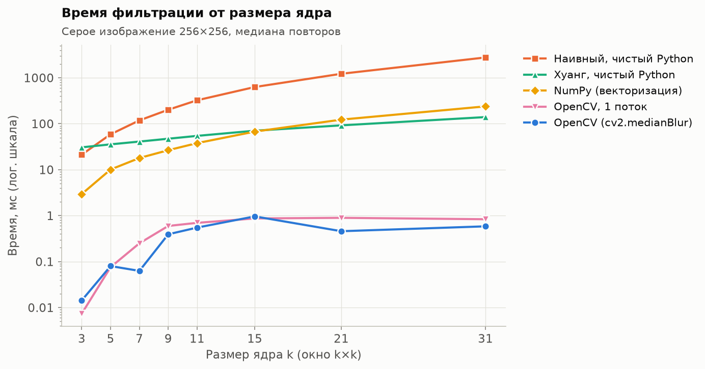

Во сколько раз OpenCV (все потоки) быстрее остальных:

| Метод | k=3 | k=5 | k=7 | k=9 | k=11 | k=15 | k=21 | k=31 |
|:---|---:|---:|---:|---:|---:|---:|---:|---:|
| Наивный, чистый Python | 1490 | 737 | 1880 | 512 | 589 | 653 | 2660 | 4720 |
| Хуанг, чистый Python | 2140 | 445 | 651 | 120 | 99.0 | 73.2 | 201 | 238 |
| NumPy (векторизация) | 206 | 126 | 286 | 67.5 | 68.9 | 70.0 | 268 | 407 |
| OpenCV, 1 поток | 0.516 | 0.946 | 3.98 | 1.52 | 1.27 | 0.902 | 1.96 | 1.43 |

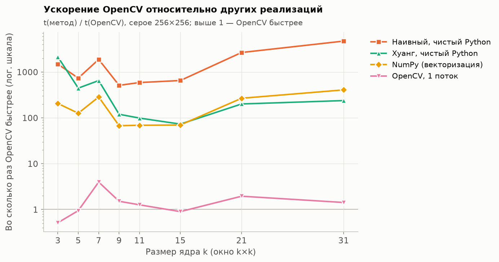

**Как растёт время нативных версий.** Если разделить время на число пикселей, наивный алгоритм ложится на параболу $0{,}0435 \cdot k^2$ мкс, а алгоритм Хуанга на прямую $0{,}0594 \cdot k + 0{,}216$ мкс. Показатель степени в $t \sim k^\alpha$ по $k$ от 5 до 31: у наивного $\alpha = 2{,}12$, у Хуанга $0{,}76$, у NumPy $1{,}74$.

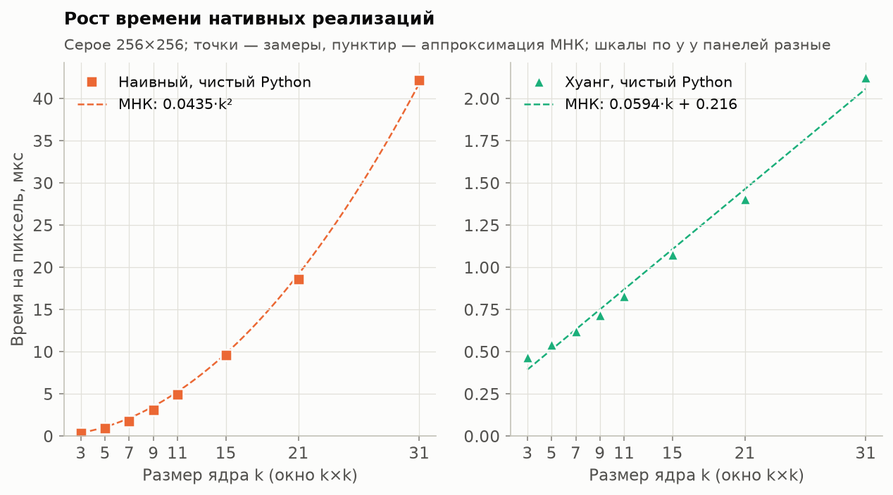

Квадратичный рост у наивного алгоритма и линейный у Хуанга видны прямо в замерах, хотя с поправками. Сортировка в п. 1.6 стоит $O(k^2 \log k)$, и если бы время росло именно так, на $k$ от 5 до 31 мы получили бы $\alpha \approx 2{,}4$, а не 2,12. Логарифм прячется, потому что Timsort адаптивный: окно реального снимка складывается из $k$ кусков соседних строк с плавными перепадами и повторами, и такие данные он сортирует почти с постоянной ценой на элемент. Мы проверили это разовым замером на 3000 окнах: на окнах camera сортировка тратит 21–45 нс на элемент при $k$ от 5 до 31, на случайных значениях 33–71 нс. У Хуанга $\alpha$ меньше единицы, потому что часть работы от $k$ не зависит: подстройка медианы и проход по строке съедают около 0,2 мкс на пиксель при любом $k$ и на малых окнах весят заметно. У NumPy $\alpha = 1{,}74 < 2$ по той же причине: `np.pad`, сборка окон и копия при `reshape` стоят почти одинаково при любом $k$, и чем больше окно, тем меньше их доля.

**Время от размера изображения** ($k = 5$, серое). У версий на Python и NumPy время на пиксель меняется не больше чем в 1,3 раза, значит общее время растёт примерно линейно с числом пикселей:

| Метод, нс на пиксель | 64×64 | 128×128 | 256×256 | 512×512 | 1024×1024 |
|:---|---:|---:|---:|---:|---:|
| Наивный, чистый Python | 810 | 803 | 827 | 926 | 814 |
| Хуанг, чистый Python | 597 | 529 | 486 | 501 | 470 |
| NumPy (векторизация) | 114 | 135 | 148 | 151 | 120 |
| OpenCV, 1 поток | 2.51 | 1.57 | 1.15 | 0.963 | 0.837 |
| OpenCV (cv2.medianBlur) | 2.82 | 1.72 | 1.22 | 0.368 | 0.166 |

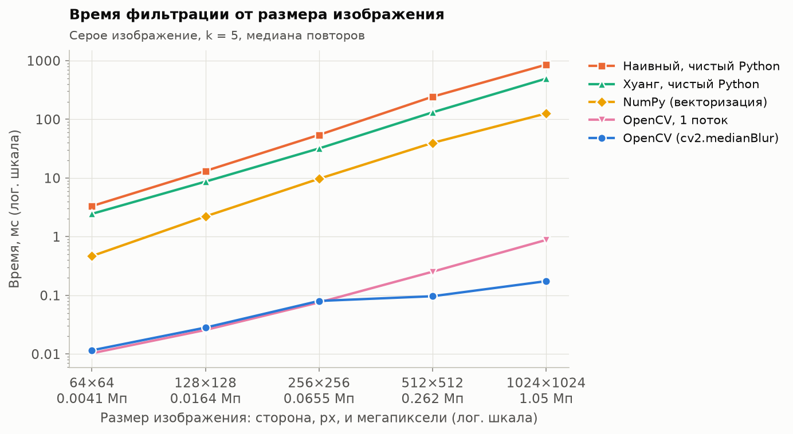

У OpenCV время на пиксель падает с ростом кадра: накладные расходы на вызов делятся на большее число пикселей. Потоки начинают помогать только на крупных кадрах. До 256×256 многопоточный режим не быстрее однопоточного (1,22 нс против 1,15), а на 1024×1024 он быстрее в 5 раз (0,166 нс против 0,837).

**Серое и цветное.** Кроп 256×256 из astronaut, время цветного делённое на время серого: у наивного, Хуанга и NumPy 2,95–3,08 при $k = 5$ и $k = 15$, по одному проходу на канал. OpenCV в одном потоке даёт 2,86 и 3,40. Многопоточный OpenCV при $k = 5$ обработал цветной кадр даже быстрее серого (отношение 0,77): на трёхканальном кадре работы втрое больше, и потоки включаются в работу, а на сером кадре большинство вызовов проходит в медленном режиме.

**Закономерности.**

1. Алгоритм Хуанга обгоняет наивный уже при $k \approx 3{,}7$. При $k = 3$ наивный быстрее (21,2 мс против 30,6): окно из 9 значений сортируется быстрее, чем строится гистограмма на 256 корзин. К $k = 31$ Хуанг быстрее в 20 раз (139 мс против 2760).
2. NumPy быстрее Хуанга до $k = 15$ включительно (67,4 мс против 70,4), но проигрывает начиная с $k = 21$ (123 мс против 92,1). Векторизация убирает интерпретатор из цикла, но оставляет $O(k^2)$ работы, и на больших окнах линейный алгоритм догоняет её даже на чистом Python.
3. Время OpenCV меняется ступенями, потому что KleidiCV переключает алгоритм (п. 1.7). В одном потоке: сети сортировки при $k \le 7$ дают 0,007–0,25 мс, скользящая гистограмма при $k$ = 9–15 даёт 0,60–0,87 мс, а с $k = 17$ гистограммы столбцов с $O(1)$ на пиксель держат время на плато 0,84–0,90 мс. Поэтому $\alpha$ для OpenCV (1,19 и 1,25) смысла не имеет.
4. Многопоточный режим при $k$ от 9 до 15 почти не ускоряет фильтр, зато тратит много лишней работы. Виновата нарезка: OpenCV режет кадр на полосы по одной строке ([`parallel.cpp`, стр. 211](https://github.com/opencv/opencv/blob/5.0.0/modules/core/src/parallel.cpp#L211) и `parallel_batches` с минимальным размером пакета 1 в `kleidicv_thread.cpp`), а KleidiCV в начале каждой полосы строит гистограмму окна заново, по $k^2$ значениям. Разовый замер процессорного времени через `getrusage` показал: при $k$ = 9, 11, 15 десять потоков тратят в 5,0, 7,1 и 9,6 раза больше процессорного времени, чем один. По часам выигрыш по таблице выше всего 34 % при $k = 9$ и 21 % при $k = 11$, а при $k = 15$ многопоточный режим даже на 11 % медленнее.
5. В остальных диапазонах картина другая. С $k = 17$ включаются гистограммы столбцов, и потоки по часам уже выигрывают в 1,96 раза при $k = 21$ и в 1,43 раза при $k = 31$, хотя процессорного времени тратят в 4,4 и 5,9 раза больше одного потока. При $k \le 7$ (сети сортировки) перерасход 1,8 раза. При $k = 3$ один поток быстрее десяти (0,007 мс против 0,014): запуск потоков дороже самой работы.
6. Даже самый быстрый наш вариант при каждом $k$ (NumPy до $k = 15$, Хуанг дальше) отстаёт от однопоточного OpenCV в 44–400 раз. Разрыв создают интерпретатор Python, на котором у Хуанга уходит 0,54 мкс на пиксель при $k = 5$, и векторные инструкции NEON: ими KleidiCV обрабатывает по 16 пикселей за раз и тратит 1,15 нс на пиксель в одном потоке на том же кадре.

### 3.3. Качество шумоподавления

Эксперимент ([`experiments.py`](experiments.py)): снимок camera 512×512, шум «соль-перец» с плотностью от 5 до 40 % (seed 42), фильтры с окнами 3, 5 и 7. Медианный фильтр сравнивается с гауссовым (`cv2.GaussianBlur` с `sigma=0`: при $k \le 7$ OpenCV берёт фиксированные биномиальные ядра [1 2 1]/4, [1 4 6 4 1]/16 и [2 7 14 18 14 7 2]/64, у них $\sigma \approx$ 0,71, 1,0 и 1,37) и усредняющим (`cv2.blur`). Метрики считаются по всему снимку против чистого оригинала. Все числа: [`results/denoise_metrics.csv`](results/denoise_metrics.csv).

PSNR, дБ, и SSIM при окне 5×5:

| Плотность шума | Без фильтра | Медианный | Гауссов | Усредняющий |
|---:|---:|---:|---:|---:|
| 5 % | 17.85 / 0.362 | **27.87 / 0.796** | 25.77 / 0.573 | 25.18 / 0.587 |
| 10 % | 14.81 / 0.193 | **27.68 / 0.794** | 23.42 / 0.441 | 23.59 / 0.484 |
| 20 % | 11.80 / 0.099 | **27.22 / 0.787** | 20.31 / 0.309 | 20.92 / 0.360 |
| 30 % | 10.02 / 0.066 | **26.58 / 0.778** | 18.05 / 0.238 | 18.75 / 0.289 |
| 40 % | 8.75 / 0.047 | **25.42 / 0.757** | 16.24 / 0.191 | 16.90 / 0.238 |

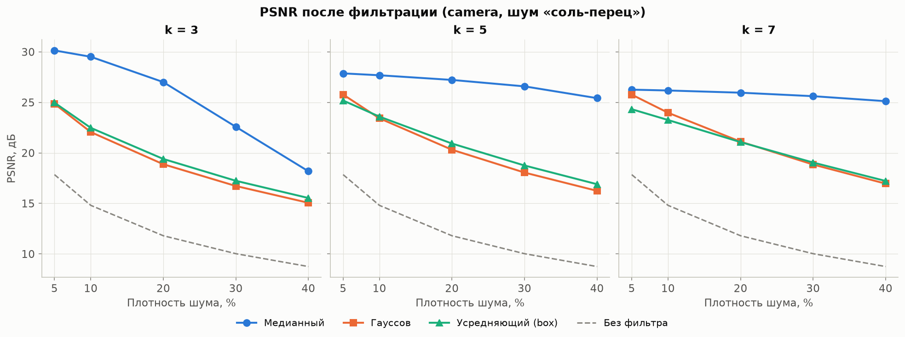

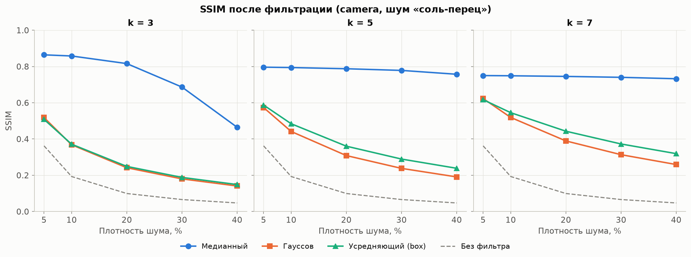

Медиана выигрывает везде. При окне 5×5 отрыв по PSNR от гауссова растёт с 2,1 дБ при 5 % шума до 9,2 дБ при 40 %, а по SSIM разница ещё нагляднее: 0,757 против 0,191 при 40 %. Причина та же, что в п. 1.2: линейные фильтры размазывают каждый импульс по окну, а медиана его отбрасывает.

Чтобы проверить, что линейные фильтры проиграли не из-за неудачных параметров, мы подобрали для каждой плотности лучшие: $\sigma$ гауссова фильтра от 0,5 до 6 с шагом 0,25 и $k$ усредняющего от 3 до 15. Медиана при этом тоже берётся с лучшим $k$ ([`results/denoise_best_linear.md`](results/denoise_best_linear.md)):

| Плотность шума | Медианный | Гауссов | Усредняющий | Отрыв медианы, дБ |
|---:|---:|---:|---:|---:|
| 5 % | k=3: 30.14 | σ=1.25: 25.88 | k=5: 25.18 | 4.3 |
| 10 % | k=3: 29.51 | σ=1.5: 23.99 | k=5: 23.59 | 5.5 |
| 20 % | k=5: 27.22 | σ=2: 21.34 | k=7: 21.06 | 5.9 |
| 30 % | k=5: 26.58 | σ=2.25: 19.22 | k=7: 19.04 | 7.4 |
| 40 % | k=5: 25.42 | σ=2.5: 17.37 | k=9: 17.25 | 8.0 |

Даже с лучшими параметрами линейные фильтры отстают на 4,3–8,0 дБ.

**Лучший размер ядра под плотность шума** ([`results/denoise_best_k.md`](results/denoise_best_k.md), перебор $k$ от 3 до 11 по PSNR):

| Плотность шума | k=3 | k=5 | k=7 | k=9 | k=11 | Лучшее k | SSIM при нём |
|---:|---:|---:|---:|---:|---:|---:|---:|
| 5 % | **30.14** | 27.87 | 26.26 | 24.78 | 23.70 | 3 | 0.864 |
| 10 % | **29.51** | 27.68 | 26.18 | 24.78 | 23.69 | 3 | 0.858 |
| 20 % | 27.00 | **27.22** | 25.96 | 24.64 | 23.62 | 5 | 0.787 |
| 30 % | 22.58 | **26.58** | 25.61 | 24.46 | 23.55 | 5 | 0.778 |
| 40 % | 18.18 | **25.42** | 25.12 | 24.21 | 23.39 | 5 | 0.757 |

Чем плотнее шум, тем больше нужно окно: при 5–10 % лучше всего $k = 3$, при 20–40 % уже $k = 5$. Правило из п. 1.4 предсказывает ровно это. Если брать наименьшее окно, после которого по формуле п. 1.2 остаётся не больше $10^{-3}$ импульсов, получается $k$ = 3, 3, 5, 5, 5 для плотностей 5, 10, 20, 30 и 40 %. Это совпадает с перебором по PSNR во всех пяти случаях. Совпадение держится на выбранном пороге: правило даёт те же $k$ при пороге от $7{,}4 \cdot 10^{-4}$ до $1{,}8 \cdot 10^{-3}$, а при $10^{-4}$ для 40 % уже требовало бы 7×7. Причём в двух пограничных случаях соседние $k$ различаются всего на 0,2–0,3 дБ (27,00 против 27,22 при 20 % и 25,42 против 25,12 при 40 %). На более плотном шуме правило тоже угадывает: в эксперименте п. 3.6 лучшее фиксированное окно 7×7 при 50 % и 11×11 при 70 %, ровно как в п. 1.4.

Окно 3×3 при 40 % проваливается до 18,2 дБ: медиана становится импульсом, когда в окне 5 и больше пикселей одного цвета, и при такой плотности это случается с 3,9 % пикселей. Каждый такой пиксель даёт ошибку до 255. Окна 7×7 и больше не выигрывают ни при одной плотности: импульсы убирает уже 5×5, а лишний размер окна только размывает. Отставание $k = 7$ от $k = 5$ сокращается с 1,6 дБ при 5 % до 0,3 дБ при 40 %. SSIM при 20 % шума выбирает $k = 3$, а не 5 (0,816 против 0,787): оставшиеся около 0,2 % импульсов (по формуле п. 1.2 выходит 0,18 %) он почти не замечает, а размытие замечает (п. 1.8).

Фрагмент camera при 10 % и 30 % шума. PSNR в подписях посчитан по показанному фрагменту, поэтому отличается от таблицы:

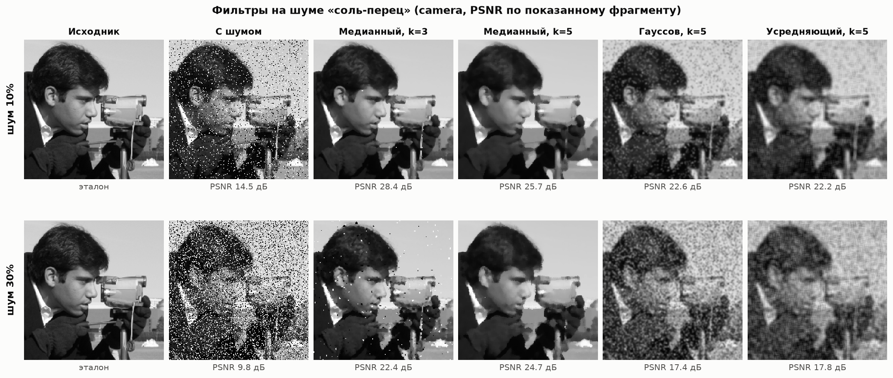

На цветном снимке (astronaut, 20 % шума) картина та же. По показанному фрагменту медиана 5×5 даёт 27,4 дБ, гауссов фильтр 19,9 дБ, усредняющий 20,4 дБ; по всему снимку 26,8, 19,7 и 20,1 дБ.

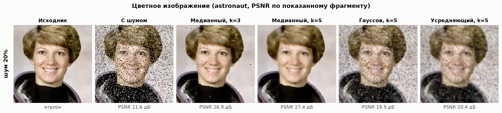

### 3.4. Переменный размер ядра

Фрагмент coffee с шумом 20 %, медиана с окном от 3 до 31. PSNR по показанному фрагменту падает с 27,1 дБ при $k = 3$ до 18,2 дБ при $k = 31$. После $k = 3$–$5$ шум уже убран, и дальше рост окна только съедает детали: блики на ложке и край блюдца расплываются в однотонные пятна.

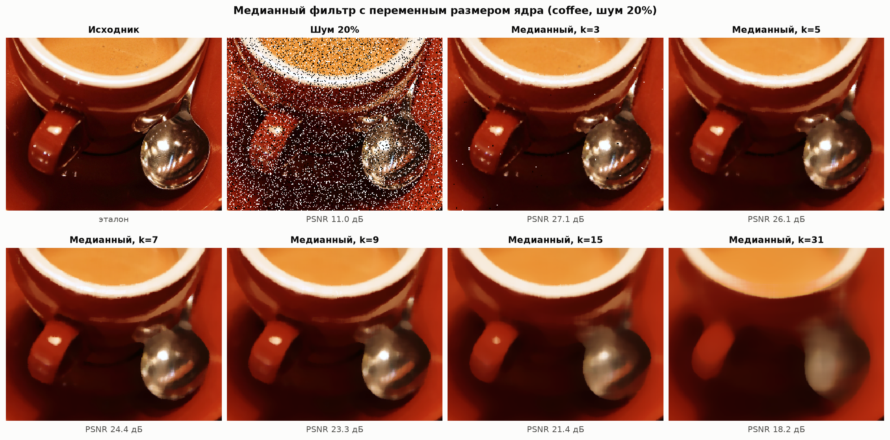

На больших окнах медиана и гауссов фильтр портят изображение по-разному. Гауссов размывает всё равномерно. Медиана сохраняет резкие контуры крупных объектов (край шлема, полосы флага), но стирает всё, что тоньше половины окна: при $k = 31$ пропадают черты лица и надписи на нашивке, а изображение превращается в набор плоских пятен с чёткими краями («акварельный» эффект).

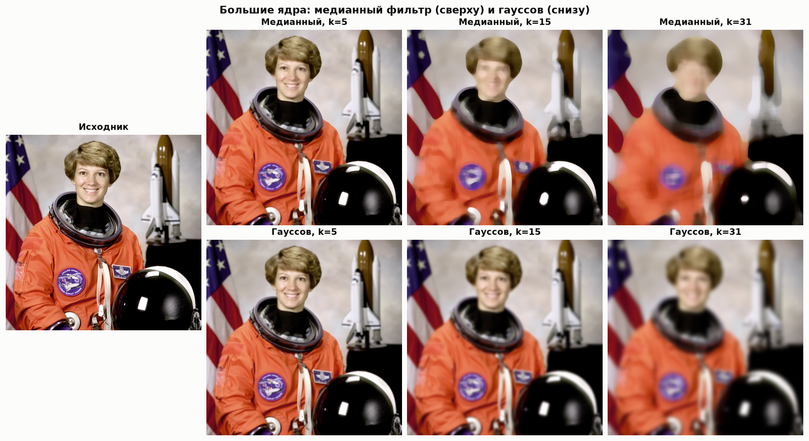

### 3.5. Сохранение границ

Мы нарисовали ступеньку 60 → 190 размером 64×128, добавили 15 % шума и измерили, на скольких пикселях яркость поднимается от 10 до 90 % высоты ступеньки. В таблице медиана по строкам, в пикселях ([`results/edge_width.md`](results/edge_width.md)):

| Фильтр | k=3 | k=5 | k=7 |
|:---|---:|---:|---:|
| Медианный | 0.80 | 0.80 | 0.80 |
| Гауссов | 2.20 | 2.97 | 3.91 |
| Усредняющий | 2.35 | 4.04 | 5.43 |

0,80 пикселя даёт идеальный скачок за один пиксель при линейной интерполяции профиля, меньше эта метрика не бывает. Медиана держит минимум при любом окне, у линейных фильтров переход расширяется вместе с $k$: при окне 7×7 он в 4,9 раза шире у гауссова и в 6,8 раза шире у усредняющего. В 20 строках из 64 медиана сдвинула границу на один пиксель, это видно на верхней картинке как редкие зубцы.

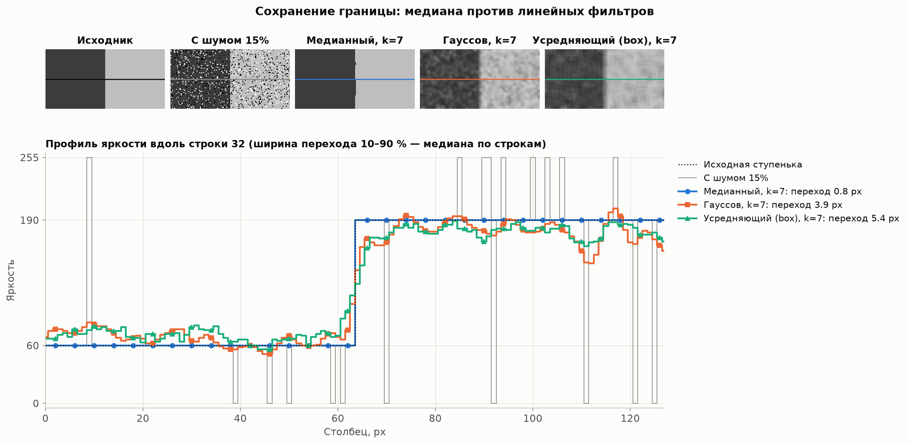

### 3.6. Адаптивный медианный фильтр

Тот же снимок camera, плотность шума от 10 до 70 %. Адаптивный фильтр (п. 2.5) с пределом окна 7×7 и 11×11 сравнивается с обычной медианой, у которой окно выбрано лучшим по PSNR из $k$ = 3…11 ([`results/adaptive.md`](results/adaptive.md)). PSNR, дБ / SSIM по всему снимку:

| Плотность шума | Медиана, лучшее k | Адаптивная, окно до 7×7 | Адаптивная, окно до 11×11 |
|---:|---:|---:|---:|
| 10 % | k=3: 29.51 / 0.858 | 33.28 / 0.943 | 33.28 / 0.943 |
| 30 % | k=5: 26.58 / 0.778 | 30.31 / 0.919 | 30.32 / 0.919 |
| 50 % | k=7: 24.46 / 0.721 | 27.16 / 0.867 | 27.28 / 0.868 |
| 60 % | k=9: 23.31 / 0.685 | 25.23 / 0.820 | 25.91 / 0.833 |
| 70 % | k=11: 21.90 / 0.647 | 20.76 / 0.693 | 24.39 / 0.786 |

С пределом 11×11 адаптивный фильтр выигрывает у лучшего фиксированного окна при любой плотности: на 3,8 дБ при 10 % и на 2,5 дБ при 70 %. Главная причина в этапе B: большинство чистых пикселей фильтр оставляет как есть (при 10 % шума меняется 14,6 % из них, у медианы 3×3 56,7 %), поэтому детали размываются меньше, и SSIM растёт сильнее PSNR (0,943 против 0,858 при 10 %). На плотном шуме решает предел окна. При 70 % окну 7×7 часто не хватает места: в нём не набирается половины чистых пикселей, и фильтр с таким пределом проигрывает обычной медиане 11×11 по PSNR (20,76 против 21,90 дБ). Окно 11×11 при 70 % действительно лучшее из фиксированных: 13×13 даёт 21,89 дБ.

Адаптивность стоит времени. На чистом Python кадр 512×512 считается 0,16–0,30 с, дольше всего при 70 % шума, где окна чаще приходится растить (столбец `seconds` в [`results/adaptive.csv`](results/adaptive.csv), один прогон). Обычная медиана 7×7 на том же кадре в OpenCV занимает около миллисекунды, а готового адаптивного фильтра в OpenCV нет.

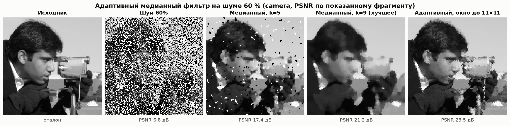

### 3.7. Интерактивный режим

`python main.py data/coffee.png -k 5 -m huang --noise 0.1 --seed 42 --interactive` открывает окно с двумя ползунками: радиус ядра и метод. Ниже кадр, который окно показывает при $k = 5$ и методе `huang`; сохранила его та же функция `render_preview`, что рисует окно, а ползунки OpenCV добавляет над кадром. Слева вход с шумом 10 %, справа результат и время. Подвинул ползунок, и кадр пересчитался.

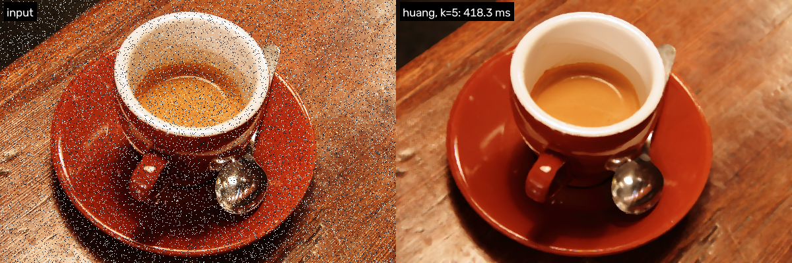

### 3.8. Что не сработало и что не проверяли

Не сработало, хотя мы на это рассчитывали:

- минимум повторов как метрика скорости. Для многопоточного OpenCV он показал ускорение в 2,5 раза там, где по медиане его нет (п. 3.2);
- многопоточный OpenCV на кадре 256×256. При $k = 15$ десять потоков на 11 % медленнее одного, а при $k$ от 9 до 15 сжигают в 5–10 раз больше процессорного времени;
- адаптивный фильтр с пределом окна 7×7 на шуме 70 %. Он проиграл обычной медиане 11×11 (20,76 против 21,90 дБ), понадобился предел 11×11;
- `cv2.medianBlur` при $k > 255$. На camera при $k = 401$ он ошибся в 43 % пикселей, поэтому обёртка такие ядра отклоняет, а собственные реализации работают при любом $k$.

Не проверяли:

- 16-битные и вещественные изображения. Поддерживается только `uint8`: `cv2.medianBlur` по документации берёт другие типы лишь при $k \le 5$, а наш алгоритм Хуанга рассчитан на 256 уровней;
- разброс скорости между запусками. Мерили на одной машине, по 3 повтора для Python; в CSV рядом с медианой лежит минимум повторов;
- процессоры x86. Линия «OpenCV» на M4 показывает KleidiCV (п. 1.7), на x86 соотношения будут другими;
- гауссов шум. По теории медиана на нём проигрывает среднему (п. 1.3), но замеров нет;
- адаптивный фильтр на других снимках, кроме camera, и его быструю версию.

## 4. Выводы

1. Медианный фильтр с переменным ядром реализован через `cv2.medianBlur` и тремя собственными способами. Все три совпадают с OpenCV бит в бит: 133 теста и 96 сверок на трёх снимках и случайном массиве 7×5, включая ядро больше изображения.
2. Встроенная функция намного быстрее: на кадре 256×256 OpenCV в 512–4720 раз быстрее наивного Python, в 73–2140 раз быстрее алгоритма Хуанга и в 68–407 раз быстрее NumPy. Даже в одном потоке OpenCV быстрее самого быстрого нашего варианта в 44–400 раз. Многопоточность на таком кадре помогает слабо: кадр режется на полосы по одной строке, гистограммы строятся заново в каждой, и при $k$ от 9 до 15 выигрыш по часам не больше 34 %, а при $k = 15$ потоки даже проигрывают.
3. Асимптотика из теории подтвердилась замерами. Время на пиксель у наивного алгоритма растёт как $k^2$ ($\alpha = 2{,}12$; логарифм от сортировки скрадывает адаптивный Timsort), у Хуанга линейно ($0{,}0594 k + 0{,}216$ мкс). Хуанг обгоняет наивный при $k \approx 3{,}7$ и к $k = 31$ работает в 20 раз быстрее. У OpenCV время меняется ступенями вслед за алгоритмом KleidiCV: в одном потоке от 0,007 мс при $k = 3$ до 0,87 мс при $k = 15$, дальше плато 0,84–0,90 мс.
4. На импульсном шуме медиана выигрывает у гауссова и усредняющего фильтров при любой плотности: при 40 % шума и окне 5×5 это 25,4 дБ против 16,2 и 16,9 дБ, а с лучшими параметрами линейных фильтров отрыв остаётся 4,3–8,0 дБ. Резкую границу медиана сохраняет (ширина перехода 0,8 пикселя при любом $k$), у линейных фильтров переход расплывается до 3,9–5,4 пикселя при $k = 7$.
5. Размер ядра нужно подбирать под плотность шума: $k = 3$ при 5–10 %, $k = 5$ при 20–40 %, $k = 7$ при 50 %, $k = 11$ при 70 %. Те же значения даёт теоретическое правило «наименьшее окно, после которого остаётся не больше $10^{-3}$ импульсов». Окно больше нужного только стирает детали: на фрагменте coffee PSNR падает с 27,1 дБ при $k = 3$ до 18,2 дБ при $k = 31$. Адаптивный фильтр подбирает окно сам и при шуме до 70 % выигрывает у лучшего фиксированного окна 2,5–3,8 дБ, но на чистом Python тратит 0,16–0,30 с на кадр 512×512. Его следующая версия напрашивается сама: растить окно на гистограмме, как у Хуанга, а не сортировать каждое окно заново.

## 5. Использованные источники

1. Gonzalez R. C., Woods R. E. Digital Image Processing. — 4th ed. — Pearson, 2018. — 1192 p. — ISBN 978-0-13-335672-4.
2. Гонсалес Р., Вудс Р. Цифровая обработка изображений / пер. с англ. Л. И. Рубанова, П. А. Чочиа. — 3-е изд., испр. и доп. — М. : Техносфера, 2012. — 1104 с. — ISBN 978-5-94836-331-8.
3. Tukey J. W. Nonlinear (nonsuperposable) methods for smoothing data // Conference Record of EASCON '74. — 1974. — P. 673.
4. Tukey J. W. Exploratory Data Analysis. — Reading, Mass. : Addison-Wesley, 1977. — xvi, 688 p. — ISBN 0-201-07616-0.
5. Rabiner L. R., Sambur M. R., Schmidt C. E. Applications of a nonlinear smoothing algorithm to speech processing // IEEE Transactions on Acoustics, Speech, and Signal Processing. — 1975. — Vol. 23, No. 6. — P. 552–557. — DOI: [10.1109/TASSP.1975.1162749](https://doi.org/10.1109/TASSP.1975.1162749).
6. OpenCV 5.0 Documentation. Image Filtering: medianBlur() [Электронный ресурс]. — URL: https://docs.opencv.org/5.0/main_modules/imgproc_filter.html#medianblur (дата обращения: 06.10.2026). То же для ветки 4.x: https://docs.opencv.org/4.x/d4/d86/group__imgproc__filter.html#ga564869aa33e58769b4469101aac458f9.
7. Gallagher N. C., Wise G. L. A theoretical analysis of the properties of median filters // IEEE Transactions on Acoustics, Speech, and Signal Processing. — 1981. — Vol. 29, No. 6. — P. 1136–1141. — DOI: [10.1109/TASSP.1981.1163708](https://doi.org/10.1109/TASSP.1981.1163708).
8. OpenCV 5.0.0. Исходный код модуля imgproc: median_blur.dispatch.cpp, median_blur.simd.hpp [Электронный ресурс]. — URL: https://github.com/opencv/opencv/tree/5.0.0/modules/imgproc/src (дата обращения: 06.10.2026).
9. NumPy v2.5 Manual. numpy.partition [Электронный ресурс]. — URL: https://numpy.org/doc/stable/reference/generated/numpy.partition.html (дата обращения: 06.10.2026).
10. Huang T. S., Yang G. J., Tang G. Y. A fast two-dimensional median filtering algorithm // IEEE Transactions on Acoustics, Speech, and Signal Processing. — 1979. — Vol. 27, No. 1. — P. 13–18. — DOI: [10.1109/TASSP.1979.1163188](https://doi.org/10.1109/TASSP.1979.1163188).
11. Perreault S., Hébert P. Median Filtering in Constant Time // IEEE Transactions on Image Processing. — 2007. — Vol. 16, No. 9. — P. 2389–2394. — DOI: [10.1109/TIP.2007.902329](https://doi.org/10.1109/TIP.2007.902329).
12. NumPy v2.5 Manual. numpy.lib.stride_tricks.sliding_window_view [Электронный ресурс]. — URL: https://numpy.org/doc/stable/reference/generated/numpy.lib.stride_tricks.sliding_window_view.html (дата обращения: 06.10.2026).
13. KleidiCV 26.03. Arm Limited. Исходный код и описание интеграции с OpenCV (doc/opencv.md) [Электронный ресурс]. — URL: https://gitlab.arm.com/kleidi/kleidicv/-/tree/26.03 (дата обращения: 06.10.2026).
14. scikit-image 0.26.0 API Reference. skimage.metrics: peak_signal_noise_ratio, structural_similarity [Электронный ресурс]. — URL: https://scikit-image.org/docs/stable/api/skimage.metrics.html (дата обращения: 06.10.2026).
15. Wang Z., Bovik A. C., Sheikh H. R., Simoncelli E. P. Image quality assessment: from error visibility to structural similarity // IEEE Transactions on Image Processing. — 2004. — Vol. 13, No. 4. — P. 600–612. — DOI: [10.1109/TIP.2003.819861](https://doi.org/10.1109/TIP.2003.819861).
16. scikit-image 0.26.0 API Reference. skimage.data: camera, astronaut, coffee [Электронный ресурс]. — URL: https://scikit-image.org/docs/stable/api/skimage.data.html (дата обращения: 06.10.2026). Лицензии снимков по документации: camera — CC0 (Lav Varshney), astronaut — общественное достояние (NASA), coffee — CC0 (Rachel Michetti).
